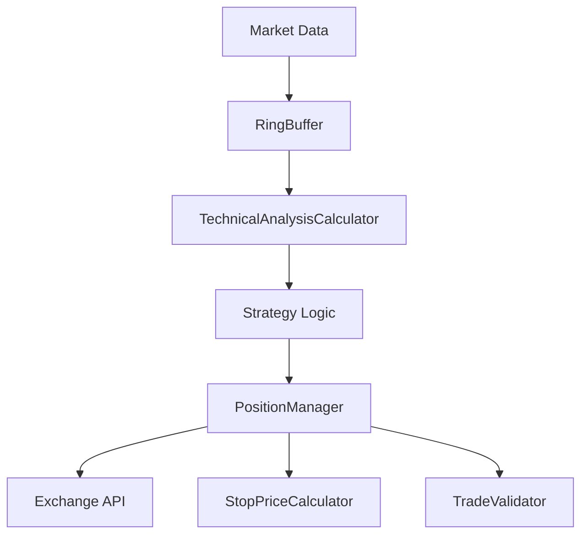

# StratWork Documentation

Welcome to StratWork, a comprehensive cryptocurrency trading framework built on top of CCXT.

## Table of Contents

- [Getting Started](getting-started.md)
- [API Reference](api-reference.md)
- [Examples](examples.md)
- [Configuration](configuration.md)
- [Best Practices](best-practices.md)

## What is StratWork?

StratWork is a Python framework designed to simplify the development and execution of cryptocurrency trading strategies. It provides:

- **Position Management**: Automated position lifecycle management
- **Technical Analysis**: Built-in technical indicators and calculations
- **Risk Management**: Configurable stop-loss and profit targeting
- **Trade Validation**: Comprehensive trade verification system
- **Exchange Integration**: Support for 100+ exchanges via CCXT

## Quick Example

```python
import ccxt
from stratwork import PositionManager, StopPriceCalculator

# Setup exchange
exchange = ccxt.binance({
    'apiKey': 'your_api_key',
    'secret': 'your_secret',
    'sandbox': True
})

# Create position manager
position_manager = PositionManager(
    long_symbol='BTC',
    short_symbol='USDT',
    max_usd_pos=1000,
    stop_price_calculator=StopPriceCalculator(stop_loss_pct=2.0),
    gain_target_pct=3.0,
    exchange=exchange,
    trading=True
)

# Execute trades
position_manager.open_long_position()
```

## Architecture Overview



## Getting Help

- 📖 Browse the [API Reference](api-reference.md)
- 🚀 Check out [Examples](examples.md)
- 🐛 Report issues on [GitHub](https://github.com/freelandm/stratwork/issues)
- 💬 Join discussions on [GitHub Discussions](https://github.com/freelandm/stratwork/discussions)

## License

StratWork is released under the MIT License. See [LICENSE](https://github.com/freelandm/stratwork/blob/main/LICENSE) for details.

---

*Last updated: {{ site.time | date: "%Y-%m-%d" }}* 